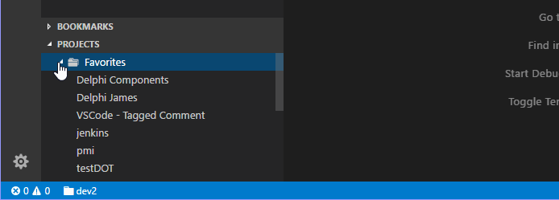

# Functionality

Manage your projects right inside Visual Studio Code. Easily access and switch between them.

You can define your own **Favorite** projects, and auto-detect **VSCode** projects, **Git**, **Mercurial** and **SVN** repositories.

# Installation

Press `F1` in VSCode, type `ext install` and then look for `Project Manager`.

# Usage

## Available commands

* **Project Manager: Edit Project** Edit the project list (`projects.json` file) directly inside **Code**
* **Project Manager: List Projects to Open** List all saved projects and pick one
* **Project Manager: List Projects to Open in New Window** List all saved projects and pick one to be opened in New Window
* **Project Manager: Refresh Projects** Refresh the cached projects (VSCode, Git, Mercurial and SVN)
* **Project Manager: Save Project** Save the current project in the manager


### Save Project

You can save the current project in the manager at any time. You just need to type a name. It even suggest you _automatically_ :)


 
### Edit Projects

For easier customization of your project list, you can edit the `projects.json` file directly inside **Code**. Just execute `Project Manager: Edit Projects` and the `projects.json` file is opened. Simple as this:

```json
[
    {
        "name": "Pascal MI",
        "rootPath": "c:\\PascalProjects\\pascal-menu-insight",
        "paths": [],
        "group": ""
    },
    {
        "name": "Bookmarks",
        "rootPath": "$home\\Documents\\GitHub\\vscode-bookmarks",
        "paths": [],
        "group": ""
    },
    {
        "name": "Numbered Bookmarks",
        "rootPath": "$home\\Documents\\GitHub\\vscode-numbered-bookmarks",
        "paths": [],
        "group": ""
    }
]
```

> For now, only `name` and `rootPath` are usefull. The `paths` and `group` fields are there to be used in the future by two new features: [Support multiple folders in the same project](https://github.com/alefragnani/vscode-project-manager/issues/46) and [Contextual Structure for Projects](https://github.com/alefragnani/vscode-project-manager/issues/50) . 

You can use a special variable called `$home` while defining any `path`. It's useful if you sync your projects between different machines, because it will be replaced by the HOME folder.  

> Be sure that the JSON file is well-formed. Otherwise, **Project Manager** will not be able to open it, and an error message like this should appear. In this case, you should use the `Open File` button to fix it.


### List Projects to Open

Shows your projects and select one to open.

### List Projects to Open in New Window

Just like **List Projects** but always opening in **New Window**.

## Keyboard Focused Users

If you are a keyboard focused user and uses _Vim like_ keyboard navigation, you can navigate thru the project list with your own keybindings. 

Just use the `when` clause `"inProjectManagerList"`, like:

```json
    {
        "key": "ctrl+j",
        "command": "workbench.action.quickOpenSelectNext",
        "when": "inProjectManagerList"
    }
```

## Available settings

#### Sort the Project List

Allows you to choose how the projects are sorted in **List Projects** commands. You can choose:

* **Saved**: The order that you saved the projects
* **Name**: The name that you typed for the project
* **Path**: The full path of the project
* **Recent**: The recently used projects

```json
    "projectManager.sortList": "Name"
```


#### Group the Project List

List the projects, grouped by its _kind_ (**Favorites**, **VS Code**, **Git**, **Mercurial** and **SVN**).

```json
    "projectManager.groupList": true
```

#### Remove the Current Project from List

By default, the current project is removed from the list. If you don't want this for any reason, just turn it off.

```json
    "projectManager.removeCurrentProjectFromList": true
```

#### Check Invalid Paths Before Listing

By default, it will check for invalid paths to display a message below the project name. If you don't want this check for any reason, just turn it off.

```json 
    "projectManager.checkInvalidPathsBeforeListing": false
```

#### Filter Projects Through Full Path

By default, it will filter projects by its **name** only. If you want to filter also based on its **path**, just turn it on.

```json 
    "projectManager.filterOnFullPath": true
```

#### Projects Location

If you intend to _share_ projects between  **Stable** and **Insider** installations, or if you store your settings in different locations (cloud services), you can indicate an _alternative_ location for the `projects.json` file.

```json
    "projectManager.projectsLocation": "C\\Users\\myUser\\AppData\\Roaming\\Code\\User"
```

#### Automatic Detection of Projects

You can have automatic detection of **VSCode** , **Git** , **Mercurial**  and **SVN**  projects. For this, you just have to indicate a list of folders where each kind of project is located.

```json
    "projectManager.git.baseFolders": [
        "c:\\Projects\\code",
        "d:\\MoreProjects\\code-testing",
        "$home\\personal-coding"
    ]
```

To customize how _deep_ to look projects or folders to be _ignored_ you have two additional settings:

```json
    "projectManager.git.ignoredFolders": [
        "node_modules", 
        "out", 
        "typings", 
        "test"
    ],
    "projectManager.git.maxDepthRecursion": 4
```

> All kinds of projects (VSCode, Git, Mercurial and SVN) have the same kind of settings

#### Cache Automatically Detected Projects

By default, the automatically detected projects (VSCode, Git, Mercurial and SVN) are cached. If you don't want this for any reason, just turn it off.

```json 
    "projectManager.cacheProjectsBetweenSessions": false
```

#### Display Project Name in Status Bar

You have the option to display the _Project Name_ in the Status Bar, so you can easily detect in which project you are.

```json 
    "projectManager.showProjectNameInStatusBar": true
```

 

#### Open Projects in New Window When Clicking in Status Bar

You can choose if it would open projects in **New Window** when clicking in status bar.

```json 
    "projectManager.openInNewWindowWhenClickingInStatusBar": true
```

## Treeview

There is also a **Projects Treeview**, right in the Explorer panel. You will have all your projects there, organized by type. A few commands were added:
* Open a project, simply clicking in the project item
* Open a project in a New Window, right clicking in the project item



#### Treeview is Optional

You can choose if you want to see the TreeView.

```json 
    "projectManager.treeview.visible": true
```

## Participate

If you have any idea, feel free to create issues and pull requests

# License

[MIT](LICENSE.md) &copy; Alessandro Fragnani

---

[](https://www.paypal.com/cgi-bin/webscr?cmd=_donations&business=EP57F3B6FXKTU&lc=US&item_name=Alessandro%20Fragnani&item_number=vscode%20extensions&currency_code=USD&bn=PP%2dDonationsBF%3abtn_donate_SM%2egif%3aNonHosted) a :coffee: and you will help me to keep working on this extension :wink:

[](https://www.paypal.com/cgi-bin/webscr?cmd=_donations&business=EP57F3B6FXKTU&lc=BR&item_name=Alessandro%20Fragnani&item_number=vscode%20extensions&currency_code=BRL&bn=PP%2dDonationsBF%3abtn_donate_SM%2egif%3aNonHosted) um :coffee: e você vai me ajudar a continuar trabalhando nesta extensão :wink: